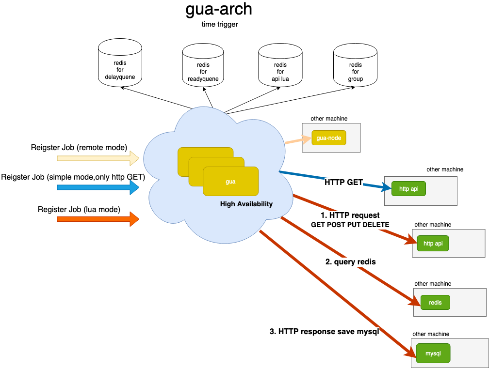
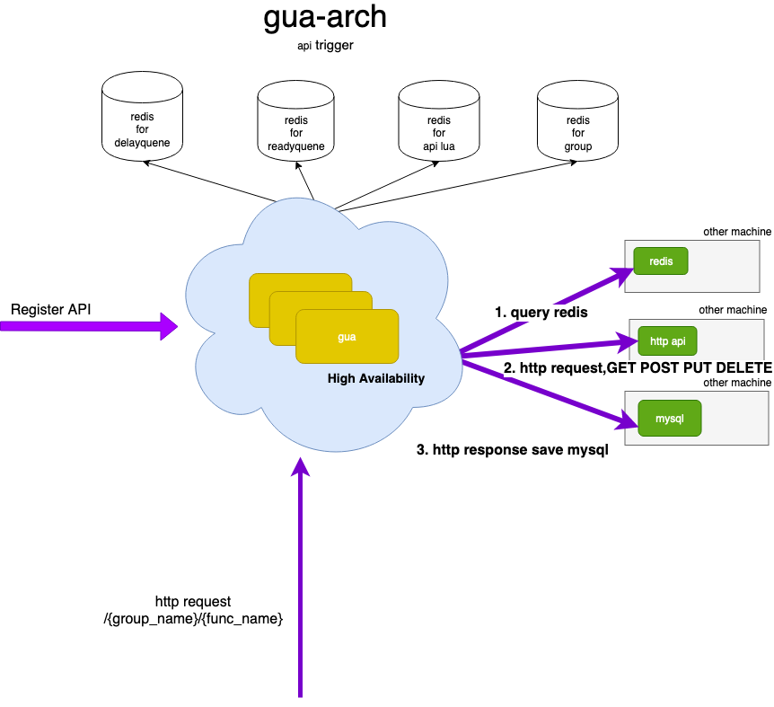

# gua

Support crontab style Schedule System  implement by golang

## Changelog

[CHANGELOG](./CHANGELOG.md)

## Usage


use env file

```
$ ./gua start -e {{env.example}} 
```


or has env

```
$ ./gua start
```

[env.example](./env.example)


## QuickStart:

[docker-compose](./docker-compose)


## Time Trigger Architecture





## Api Trigger Architecture





## Api


### admin api

[api v1](./apiv1.md)


## How to use time trigger for lua mode?

[lua mode doc](./luamode.md)


## How to use api trigger

[api trigger](./funclua.md)

