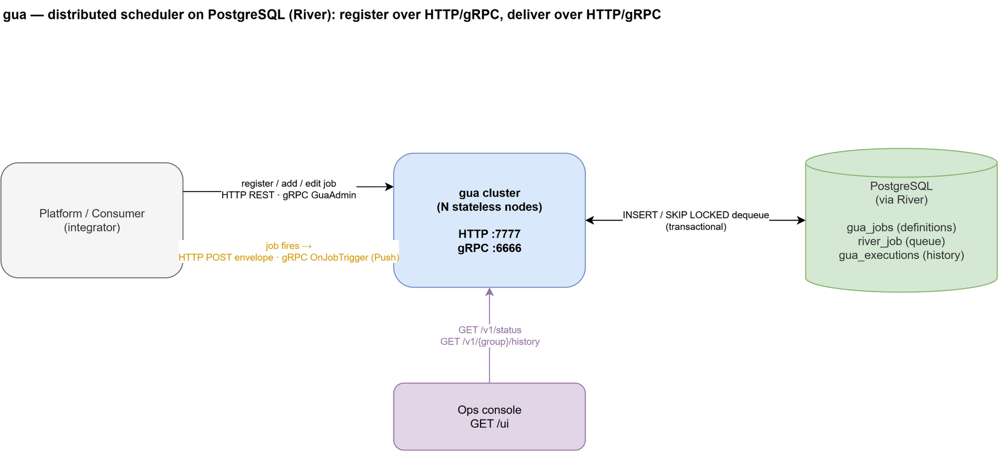
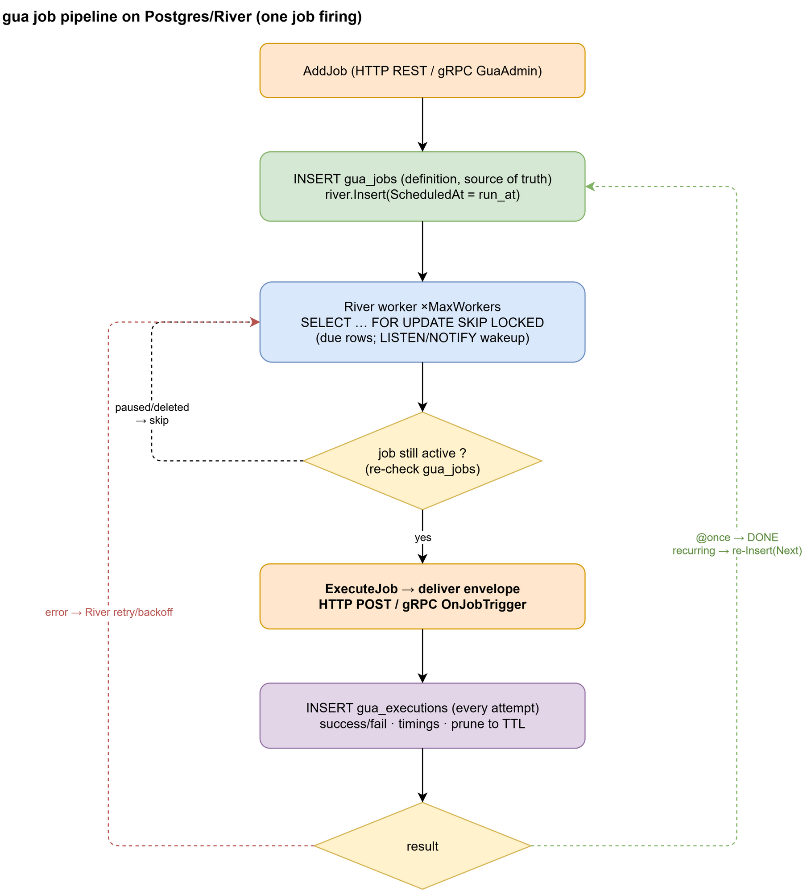
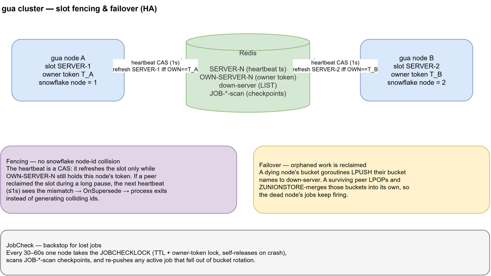

# gua architecture (PostgreSQL / River)

> 🌐 **English** · [繁體中文](ARCHITECTURE.zh-TW.md)

gua is a distributed, crontab-style scheduler backed by PostgreSQL via
[River](https://riverqueue.com). Clients register jobs over **HTTP REST or
gRPC**; when a job fires gua delivers a **trigger envelope** to the consumer
over **HTTP POST or gRPC Push**. gua nodes are stateless and scale horizontally.

> Diagram sources are the `.drawio` files next to each PNG — open them in
> draw.io to edit.

## System overview

- **Register / CRUD** (consumer → gua): `RegisterGroup`, `AddJob`, `EditJob`,
  `PauseJob`, `ActiveJob`, `DeleteJob`, `ListJobs` — HTTP REST (`/v1/...`) and
  the equivalent gRPC `GuaAdmin` service. Both are thin adapters over one
  `Quene` implementation, so validation and error semantics are identical.
- **Delivery** (gua → consumer, when a job fires): the same envelope
  (`job_id, job_name, group_name, plan_time, exec_time, payload, idempotency_key`) is sent as a
  JSON `POST` (HTTP) or via `GuaCallback.OnJobTrigger` (gRPC Push). The
  consumer's `2xx` / `JobResult` is the execution result.
- **Monitoring**: `GET /v1/status`, `GET /v1/groups/{group}/history`, web console
  `GET /ui`. See [MONITORING.md](MONITORING.md).

## Pipeline

`AddJob` validates the job, writes its **definition** to `gua_jobs` (the source
of truth) and schedules an **occurrence** with `river.Insert(ScheduledAt=run_at)`
— in one transaction, so a definition never exists without its occurrence. The
occurrence carries only the firing's identity (`job_id`, `group_name`,
`plan_time`).

River workers dequeue due rows with `FOR UPDATE SKIP LOCKED` (woken by
LISTEN/NOTIFY) and then:

1. **load the definition** from `gua_jobs` — a job deleted or paused after the
   occurrence was scheduled is skipped, and an `Edit` made in the meantime is
   what gets delivered;
2. **deliver** the envelope with the job's `timeout` (default 30s, capped at
   10m) and record the attempt in `gua_executions`;
3. on success, drop a `@once` definition, or for a recurring job compute cron
   `Next()`, store it as the definition's `exectime` (what the job list shows)
   and insert the next occurrence — atomically, and only if the job is still
   active;
4. on failure, return the error so River retries with backoff; when the last
   attempt (`GUA_MAX_ATTEMPTS`, default 25) fails the definition is **paused**
   (`active=false`) so the exhausted job stays visible.

`Pause`, `Delete`, `Active` and `RemoveGroup` replace or remove the pending
occurrence in the same transaction as the definition change; `Active` never
adds a second occurrence.

- **Delivery is at-least-once**: River retries failures and rescues jobs from
  crashed workers, so a job can run more than once — **consumers must be
  idempotent**. Dedupe on the envelope's **`idempotency_key`** (stable across
  re-deliveries of the same firing; `exec_time` is not). (`SKIP LOCKED` makes
  *dequeue* exactly-once; it's the deliver-then-crash window that can re-deliver.)
- **Timing**: jobs scheduled for the future are promoted by River's scheduler,
  which adds a few seconds of latency vs an in-memory ticker. For scheduling at
  minute/hour granularity this is irrelevant; for sub-second precision it is the
  trade-off for durability. See [EVAL.md](EVAL.md) for measured numbers.
- **Shutdown**: on SIGTERM the admin listeners drain, then River gets 10s for
  in-flight deliveries and cancels the rest; a delivery cut off this way is
  retried (same `idempotency_key`).

## Cluster & HA

Stateless horizontal scaling: every node dequeues from the same Postgres with
`SKIP LOCKED`, so each job runs on exactly one node. There is **no** slot
election, owner-token fencing, per-node bucket, down-server reclaim, or de-dup
fence — Postgres row locks do the coordination. River runs its own leader
election (PG advisory locks) for singleton maintenance (scheduler / rescuer /
periodic jobs), and its rescuer reclaims jobs left `running` by a crashed
worker after 15 minutes.

## Postgres schema

| Table | Purpose |
|---|---|
| `gua_jobs` | job definitions (active/paused) — the source of truth; `exectime` = next fire |
| `gua_groups` | group namespace markers |
| `gua_executions` | execution history (per attempt); pruned to `GUA_HISTORY_TTL` by a periodic River job (indexed on `created_at`) |
| `river_job` (+ River's tables) | the queue: scheduled occurrences, retries, state; gua matches its rows by `args @> {...}` to use River's GIN index |

## See also

- [apiv1.md](apiv1.md) — admin REST API
- [`proto/gua.proto`](../proto/gua.proto) — gRPC `GuaAdmin` + `GuaCallback`
- [MONITORING.md](MONITORING.md) — status / history / console / logging
- [EVAL.md](EVAL.md) — JobScheduler replacement evaluation
- [pg-migration.md](pg-migration.md) — the Redis → Postgres migration
