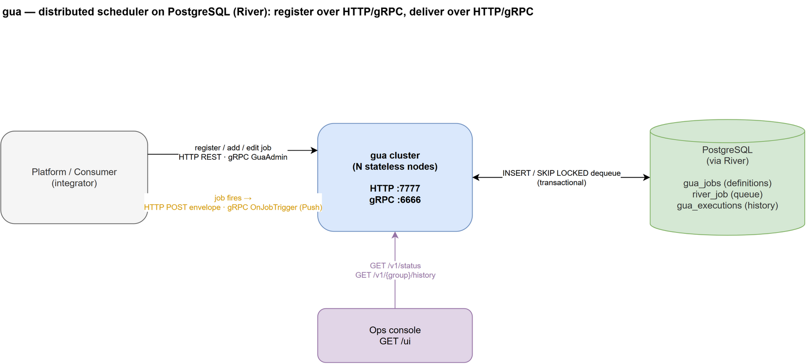
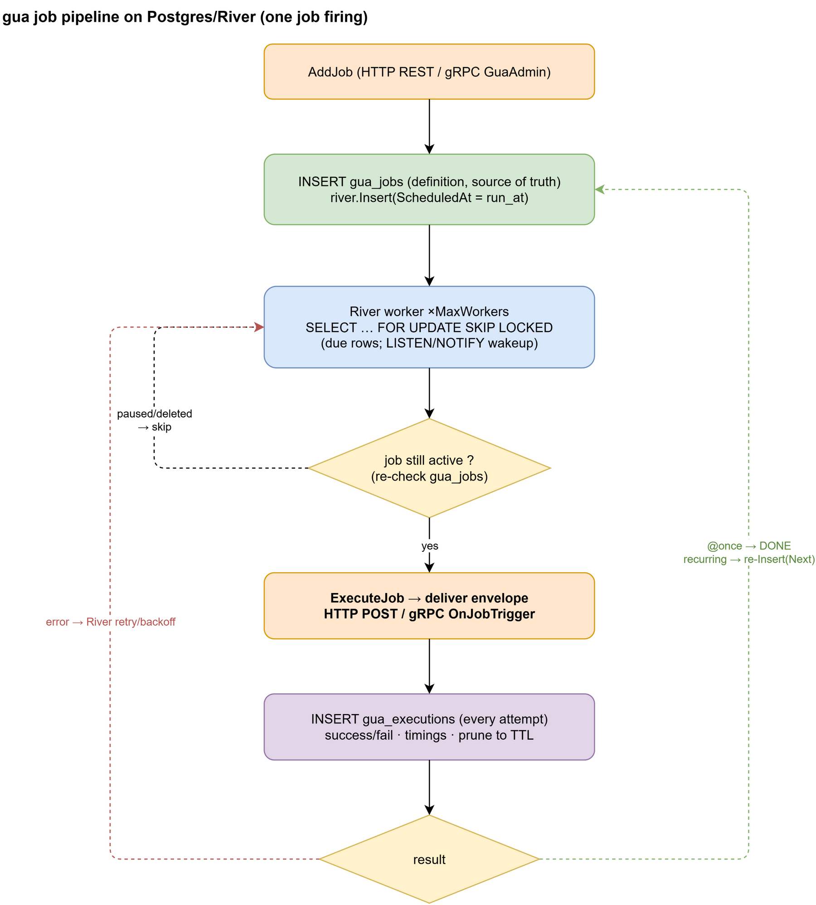
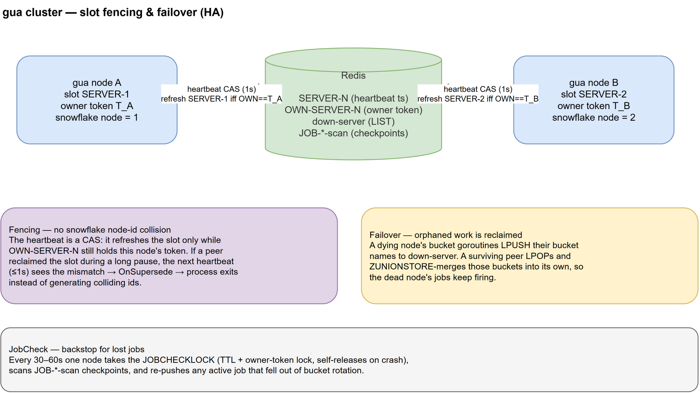

# gua 架構(PostgreSQL / River)

> 🌐 [English](ARCHITECTURE.md) · **繁體中文**

gua 是一套分散式、crontab 風格的排程器,後端為 PostgreSQL(透過
[River](https://riverqueue.com))。客戶端用 **HTTP REST 或 gRPC** 註冊 job;job
觸發時 gua 用 **HTTP POST 或 gRPC Push** 把 trigger 信封送給消費者。gua 節點無
狀態、可水平擴展。

> 圖的原始檔是每張 PNG 旁邊的 `.drawio` —— 用 draw.io 開即可編輯。

## 系統總覽

- **註冊 / CRUD**(消費者 → gua):`RegisterGroup`、`AddJob`、`EditJob`、
  `PauseJob`、`ActiveJob`、`DeleteJob`、`ListJobs` —— HTTP REST(`/v1/...`)與
  等價的 gRPC `GuaAdmin` service。
- **投遞**(gua → 消費者,job 觸發時):同一份信封
  (`job_id, job_name, group_name, plan_time, exec_time, payload, idempotency_key`)以 JSON `POST`
  (HTTP)或 `GuaCallback.OnJobTrigger`(gRPC Push)送出。消費者的 `2xx` /
  `JobResult` 即執行結果。
- **監控**:`GET /v1/status`、`GET /v1/{group}/history`、Web console `GET /ui`。
  見 [MONITORING.zh-TW.md](MONITORING.zh-TW.md)。

## Pipeline

`AddJob` 把 job **定義**寫進 `gua_jobs`(真實來源),並用
`river.Insert(ScheduledAt=run_at)` 排定一個 **occurrence**。River worker 用
`FOR UPDATE SKIP LOCKED` 撈到期的 row(由 LISTEN/NOTIFY 喚醒),再確認定義仍是
`active`、投遞信封、把這次嘗試記進 `gua_executions`。`@once` 投完即結束;recurring
則用 cron `Next()` 重排下一個 occurrence。投遞失敗由 River 重試。

- **投遞是 at-least-once**:River 會重試失敗、並把崩潰 worker 的 job 撿回,所以
  一個 job 可能被投遞超過一次 —— **消費端必須冪等**。請對信封的
  **`idempotency_key`** 去重(同一次觸發的重投間穩定;`exec_time` 不是)。
  (`SKIP LOCKED` 讓「撈取」是 exactly-once;會重投的是「投遞成功後、commit 前崩潰」那個窗口。)
- **時間特性**:排在未來的 job 由 River 的 scheduler 提升(promote),相對於
  in-memory ticker 會多幾秒延遲。對分鐘/小時級的排程無感;若要 sub-second 精度,
  這就是換取持久性的代價。實測數字見 [EVAL.zh-TW.md](../EVAL.zh-TW.md)。

## 叢集與 HA

無狀態水平擴展:每台節點都對同一顆 Postgres 用 `SKIP LOCKED` 撈,所以每個 job
只會在一台節點上跑。**沒有** slot 選舉、owner-token fencing、per-node bucket、
down-server 接管、或去重 fence —— 由 Postgres 的 row lock 做協調。River 自己跑
leader election(PG advisory lock)來協調單例維護任務(scheduler / rescuer),
其 rescuer 會把崩潰 worker 留下的 `running` job 撿回重跑。

## Postgres schema

| 表 | 用途 |
|---|---|
| `gua_jobs` | job 定義(active/paused)—— 真實來源 |
| `gua_groups` | group 命名空間標記 |
| `gua_executions` | 執行歷史(每次嘗試),依 `GUA_HISTORY_TTL` 修剪 |
| `river_job`(+ River 的表) | 佇列:排定的 occurrence、重試、狀態 |

## 延伸閱讀

- [apiv1.zh-TW.md](../apiv1.zh-TW.md) — admin REST API
- [`proto/gua.proto`](../proto/gua.proto) — gRPC `GuaAdmin` + `GuaCallback`
- [MONITORING.zh-TW.md](MONITORING.zh-TW.md) — 狀態 / 歷史 / console / logging
- [EVAL.zh-TW.md](../EVAL.zh-TW.md) — 取代 JobScheduler 評估
- [pg-migration.zh-TW.md](pg-migration.zh-TW.md) — Redis → Postgres 遷移
